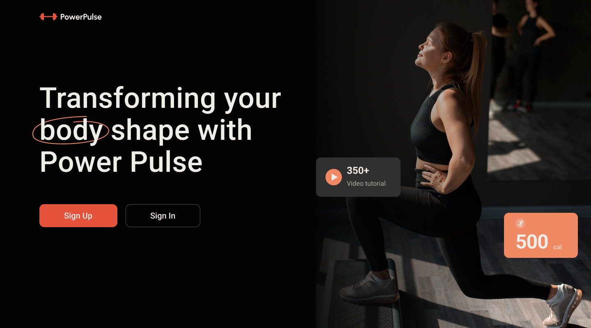

# React & Node.js app

## The server part of the PowerPulse Fitness&Diet project

## Technologies

The project was created on the [Node.js](https://nodejs.org/en/docs/) platform using [Express](https://devdocs.io/express/) framework

Communication with the database is provided by using [mongoose](https://mongoosejs.com/docs/documents.html) library through the [MongoDB](https://www.mongodb.com/docs/) database management system

## API description

Comprehensive information on handling endpoints is available within the [Power Pulse API](https://power-pulse-rh13.onrender.com/api-docs/) documentation.

Documentation created using the [swagger-ui-express](https://www.npmjs.com/package/swagger-ui-express) package

## Figma

`Look at`
[**Figma**](https://www.figma.com/file/FHAaMcWwZCDbzWPlowFhEf/Power-Pulse?type=design&mode=design&t=pEbMMrU24sjh3Lm3-0) project design

# Development team :

- 
  Lesia Soloviova **Team Lead**

- 
  Roksolana Protsiv **Full Stack Developer**

- 
  Serhii Ozeran **Full Stack Developer**

- 
  Viktoriia Sembai **Full Stack Developer**

- 
  Aldoshin Vladislav **Full Stack Developer**

### Commands:

- `npm install` &mdash; start
- `npm start` &mdash; server start in production mode
- `npm run start:dev` &mdash; start the server in development mode
